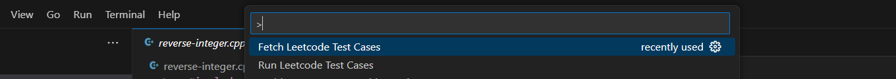
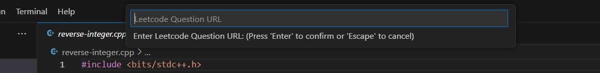

# CPH-Leetcode-Ash
This is a CPH VS Code extension for Leetcode. Supports multiple Languages! By Ashnidh :)

Supported Languages:
* C
* C++
* Python

## Features
* Requires only problem URL to fetch, parse and store multiple test cases. Custom TestCases can be added.
* Auto-detects the language of your code to run TestCases.
* Displays detailed description each TestCase result **{input, expected_output, recieved output}** and errors (if exists) in the output terminal. 
* Displays the final verdict as a VSCode Notification.

## Setting Up ( Install from source )
```
git clone https://github.com/Ashnidh/CPH-Leetcode-Ash.git
cd CPH-Leetcode-Ash
npm install
```
And then you can run it in a debug window.

## Commands

<div align="center">
  
</div> 

* ### ```cph-leetcode-ash.fetch```: Fetch Leetcode Test Cases
    On Running - Asks for Leetcode Problem URL.
        <div align="center">
        
        </div> 
    When the URL is entered, it creates a directory ```./cases/question_titleSlug/``` in the currently active working directory where all the input and output cases are parsed and saved as ```input_1.txt```, ```output_1.txt``` for every tescase
    (Multiple testcases are supported!!). 

    While adding a custom TestCase, new input and output files should be created and stored with the same naming convension.


* ### ```cph-leetcode-ash.run```: Run Leetcode Test Cases
    Switch your currenlty active VSCode tab to the solution source code **(.cpp/.c/.py)** and run the command.

    It automatically idenifies the language of the written code solution and displays detailed description each TestCase result **{input, expected_output, recieved output}** and errors (if exists) in the output terminal. 

    It also displays the final verdict as a VSCode Notification.

## Dependencies
*     "jsdom": "^26.0.0"